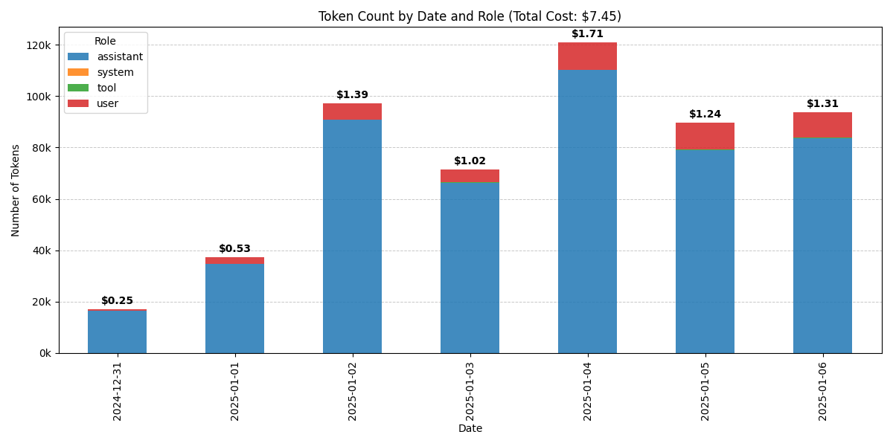

# ChatGPT Stats

A Python utility for analyzing data exports from ChatGPT and visualizing  usage trends.

## Overview

The **ChatGPT Stats** tool processes ZIP files containing ChatGPT data exports, extracts 
the relevant conversation data, calculates token usage for each message, and generates 
insightful visualizations. The primary output is a stacked bar chart that displays token usage 
over time, categorized by roles (e.g., user, assistant).



## Features

- Extracts conversation data (`conversations.json`) from a ChatGPT ZIP export.
- Calculates token counts for messages using an approximation of characters per token.
- Generates a **stacked bar chart** showing token usage by role over time.
- Robust error handling and logging for better traceability.

## Installation

1. Clone the repository:
    ```bash
    git clone https://github.com/sakishinoda/chatgpt-stats.git
    cd chatgpt-stats
    ```

2. Install the required dependencies:
    ```bash
    pip install -r requirements.txt
    ```

## Usage

Run the tool from the command line:

```bash
python -m src.chatgpt_stats.plot <ZIP_PATH> [--extract-to <EXTRACT_PATH>]
```

### Arguments

- **`ZIP_PATH`** (required): Path to the ZIP file containing the ChatGPT export.
- **`--extract-to`** (optional): Path to extract the `conversations.json` file. Default is `/tmp/conversations.json`.

### How to Export Your ChatGPT Data

To use this tool, you need to first export your ChatGPT data. Follow these steps:

1. **Log in to ChatGPT**:
   - Go to [chat.openai.com](https://chat.openai.com) and log in with your OpenAI account.

2. **Navigate to Settings**:
   - Click on your profile icon or the menu in the bottom-left corner.
   - Select **Settings** from the menu.

3. **Request Data Export**:
   - In the settings panel, click **Data Controls** (or similar, depending on the UI).
   - Find the **Export Data** option and click it.
   - Confirm your request.

4. **Wait for Email**:
   - OpenAI will send an email with a link to download your data export. This may take a few minutes.

5. **Download the ZIP File**:
   - Click the download link in the email and save the ZIP file to your computer.

You can now use this ZIP file as input to the **ChatGPT Stats** tool!

### Example

```bash
python -m src.chatgpt_stats.plot /path/to/export.zip --extract-to /path/to/conversations.json
```

### Output

- **Stacked Bar Chart**: Visualizes token counts by role over time.
- **Logs**: Detailed logs are saved to the specified log file (or `chatgpt-stats.log` by default).

## Project Structure

```
chatgpt-stats/
├── src/
│   ├── chatgpt_stats/
│   │   ├── extract.py          # Utility for extracting files from ZIP archives
│   │   ├── plot.py             # Main script for processing and plotting
├── README.md                   # Project documentation
├── LICENSE.md                  # License information
├── requirements.txt            # List of dependencies
```

## Dependencies

The project requires the following Python libraries:
- [pandas](https://pandas.pydata.org/)
- [matplotlib](https://matplotlib.org/)
- [click](https://click.palletsprojects.com/)
- [loguru](https://loguru.readthedocs.io/)

Install dependencies using:
```bash
pip install -r requirements.txt
```

## Development

Contributions are welcome! To get started:
1. Fork the repository.
2. Create a new branch for your feature/bugfix:
    ```bash
    git checkout -b my-feature-branch
    ```
3. Make your changes and test thoroughly.
4. Submit a pull request.

## License

This project is licensed under the MIT License. See [LICENSE.md](LICENSE.md) for details.

## Acknowledgments

This work was co-authored by ChatGPT 4o.

---

Happy analyzing!
